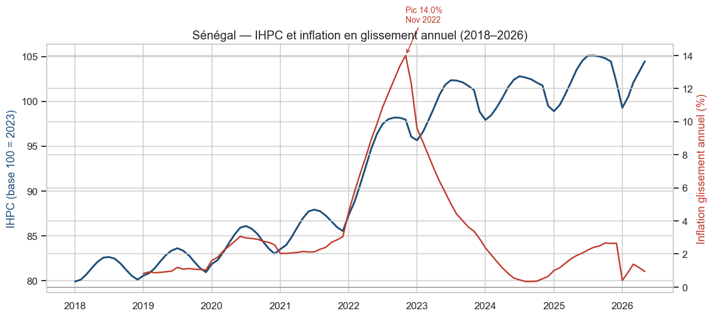

# 🇸🇳 Coût de la vie et inflation au Sénégal (2018–2026)

> Projet **Business Intelligence** de bout en bout : analyse de l'évolution du
> coût de la vie et de l'inflation au Sénégal, du nettoyage des données au
> tableau de bord Power BI, en passant par l'analyse SQL et la prévision.


### 🌍 [**Voir le site web du projet (démo en ligne)**](https://kheuch1492.github.io/cost-of-living-senegal/)

---

## 🎯 Objectif

Analyser l'évolution du coût de la vie au Sénégal entre **2018 et 2026** pour :

- suivre l'évolution des prix des biens essentiels (riz, huile, sucre,
  carburant, pain…) ;
- mesurer l'**inflation** (mensuelle et en glissement annuel) ;
- comprendre l'impact sur le **pouvoir d'achat** des ménages ;
- identifier les produits les plus **inflationnistes** ;
- **prévoir** les prix futurs ;
- comparer les **différences régionales**.

---

## 📊 Résultats clés

| Indicateur | Résultat |
|---|---|
| Inflation moyenne 2022 (pic) | **+9,9 %** (sommet **+14,0 %** en nov. 2022) |
| Désinflation 2023 → 2024 | +5,7 % → +0,9 % |
| Produit le plus inflationniste | **Oignon (+96 %)**, pomme de terre (+77 %) |
| Hausse du coût du panier (2018→2026) | **+37 %** |
| Meilleur modèle de prévision | **SARIMA** (RMSE 0,77 ; MAPE 0,6 %) — Prophet aussi intégré |
| Inflation prévue (12 prochains mois) | **~0,7 %** (maîtrisée) |



---

## ⚠️ Sources & transparence

- **Agrégats nationaux calibrés sur le réel** (ANSD — *Indice Harmonisé des Prix
  à la Consommation*, base 100 = 2023 ; Banque mondiale) : trajectoire de
  l'inflation, pic 2022, structure en 12 divisions COICOP/NCOA, 6 zones de
  collecte (Dakar, Thiès, Saint-Louis, Diourbel, Kaolack, Kolda).
- **Détail mensuel par produit et région : reconstruit** de façon cohérente avec
  ces agrégats (l'ANSD ne publie pas cette granularité en format structuré).
  → Écart moyen **< 0,2 pt** vs inflation officielle (validation dans le notebook 01).

Voir [`data/dictionnaire_donnees.md`](data/dictionnaire_donnees.md) et
[`scripts/generate_data.py`](scripts/generate_data.py).

---

## 🗂️ Structure du projet

```
cost-of-living-senegal/
├── data/
│   ├── raw/                 # données brutes (à nettoyer) + tables de référence
│   ├── processed/           # modèle en étoile propre (sortie du notebook 01)
│   ├── geo/                  # GeoJSON des régions du Sénégal (carte)
│   └── dictionnaire_donnees.md
├── notebooks/
│   ├── 01_nettoyage_preparation.ipynb   # nettoyage + variables dérivées
│   ├── 02_analyse_exploratoire.ipynb    # EDA + 13 visualisations dont carte choroplèthe
│   └── 03_prevision_forecasting.ipynb   # SARIMA / régression / Prophet
├── sql/
│   ├── 01_schema_postgres.sql           # modèle en étoile + chargement
│   └── 02_analyses.sql                  # 10 requêtes analytiques
├── powerbi/
│   ├── README_powerbi.md                # guide de construction du dashboard
│   └── mesures_dax.txt                  # mesures DAX prêtes à coller
├── models/                  # comparaison des modèles + prévisions (CSV)
├── reports/
│   ├── rapport_analytique.md / .pdf     # rapport complet (Markdown + PDF)
│   └── figures/                         # 15 graphiques PNG (dont carte choroplèthe)
├── scripts/
│   ├── generate_data.py                 # génération des données
│   ├── _build_notebooks.py              # construction des notebooks
│   └── run_all.py                       # pipeline complet
├── requirements.txt
└── README.md
```

---

## 🚀 Démarrage rapide

```bash
# 1. Environnement
python -m venv .venv
.venv\Scripts\activate          # Windows  (source .venv/bin/activate sous Linux/Mac)
pip install -r requirements.txt

# 2. Exécuter tout le pipeline (données -> notebooks -> figures -> modèles)
python scripts/run_all.py

# 3. (Optionnel) ouvrir les notebooks
jupyter lab
```

Le pipeline régénère `data/processed/`, `reports/figures/` et `models/`.

---

## 🛠️ Étapes du projet

1. **Compréhension des données** — IHPC, divisions COICOP, glissement annuel,
   pouvoir d'achat.
2. **Nettoyage** (notebook 01) — dates hétérogènes, casse, séparateurs décimaux,
   doublons, valeurs aberrantes, imputation ; **variables dérivées** (variation
   mensuelle/annuelle, moyenne mobile, indice base 100, prix réel déflaté).
3. **EDA** (notebook 02) — 13 visualisations : évolution de l'inflation, heatmaps
   division/région, **carte choroplèthe** des 14 régions, top produits, alimentaire vs énergie, boxplots, décomposition
   STL, panier, pouvoir d'achat, contributions.
4. **SQL** (`sql/`) — inflation annuelle, top hausses, comparaison régionale,
   coût du panier, contribution des divisions, volatilité, pic historique.
5. **KPI** — inflation globale / alimentaire / énergie, coût du panier, pouvoir
   d'achat (mesures DAX dans `powerbi/`).
6. **Prévision** (notebook 03) — comparaison Marche aléatoire / Régression /
   **SARIMA** / **Prophet** ; sélection par RMSE-MAE ; prévision à 12 mois.
7. **Analyse régionale** — comparaison des 6 zones, heatmap, carte (Power BI).
8. **Dashboard Power BI** — KPI, visualisations, carte du Sénégal, filtres
   (cf. [`powerbi/README_powerbi.md`](powerbi/README_powerbi.md)).
9. **Recommandations économiques** — cf. [rapport](reports/rapport_analytique.md).

---

## 📦 Livrables

- ✅ Notebooks Python (EDA + forecasting) **exécutés**
- ✅ Scripts SQL d'analyse (PostgreSQL)
- ✅ Guide + mesures DAX pour le dashboard Power BI
- ✅ Rapport analytique ([`reports/rapport_analytique.md`](reports/rapport_analytique.md))
- ✅ README GitHub

---

## 🧰 Technologies

`Python` (pandas, numpy, matplotlib, seaborn, scikit-learn, statsmodels) ·
`SQL` (PostgreSQL) · `Power BI` · `Jupyter` · prévision `SARIMA` / `Prophet`.

## 🎓 Compétences démontrées

Analyse macroéconomique & inflation · nettoyage et modélisation de données ·
SQL analytique · séries temporelles & forecasting · KPI économiques ·
data storytelling · analyse régionale · Power BI.

---

*Projet réalisé à des fins de portfolio. Les chiffres nationaux sont calibrés
sur les publications de l'[ANSD](https://www.ansd.sn) ; le détail produit/région
est reconstruit et ne constitue pas une statistique officielle.*
