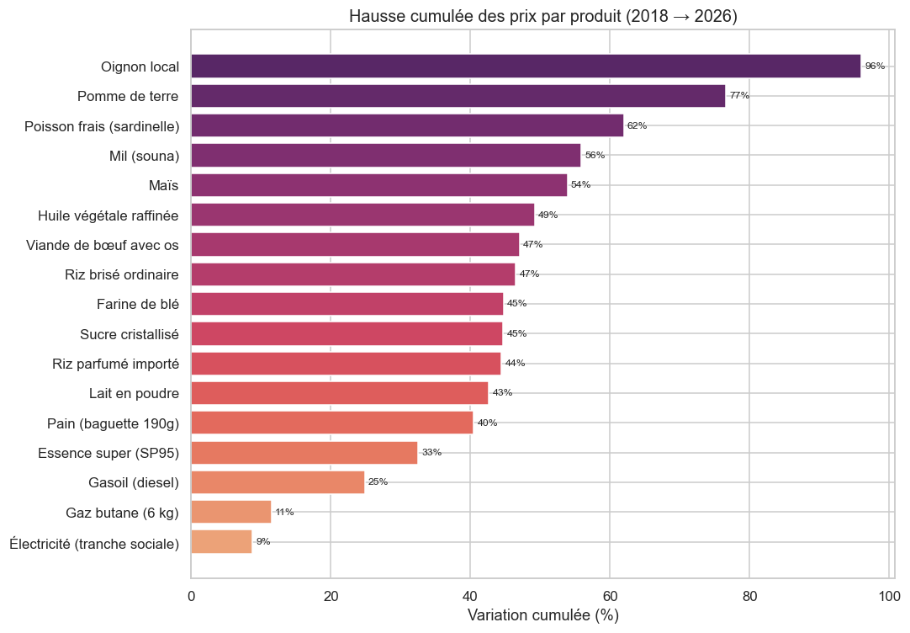
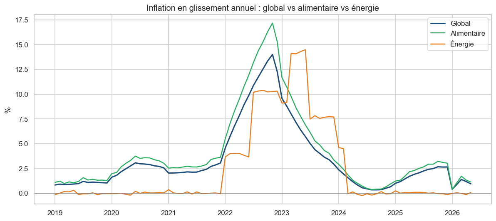
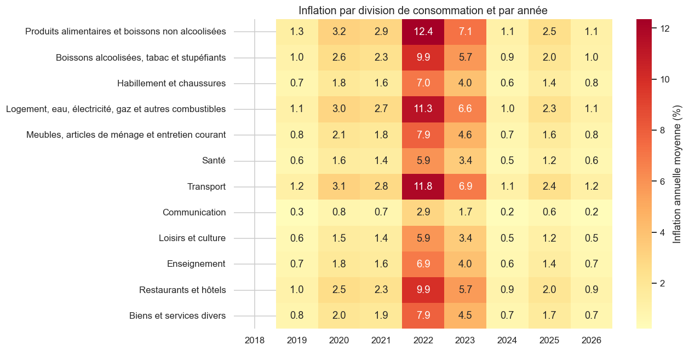
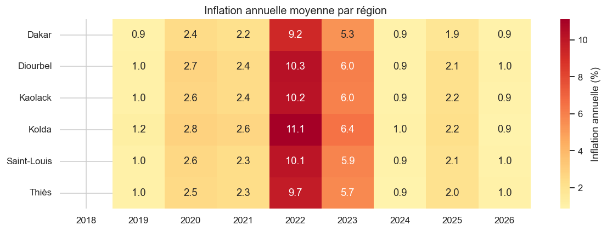
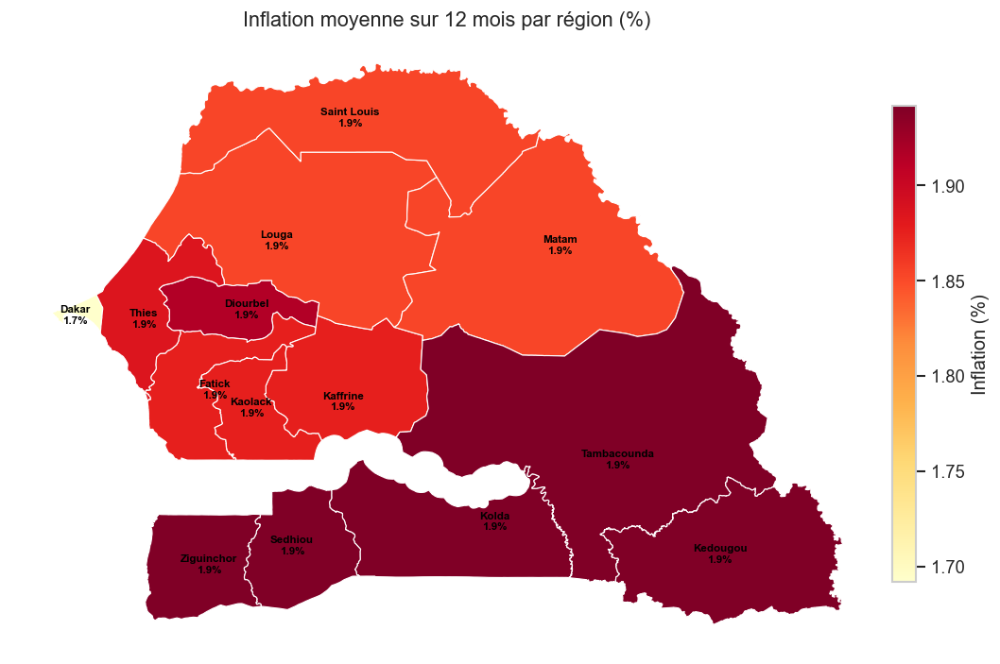
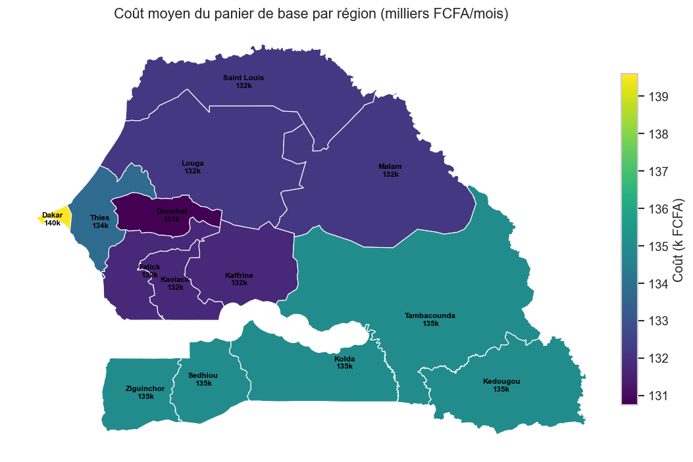
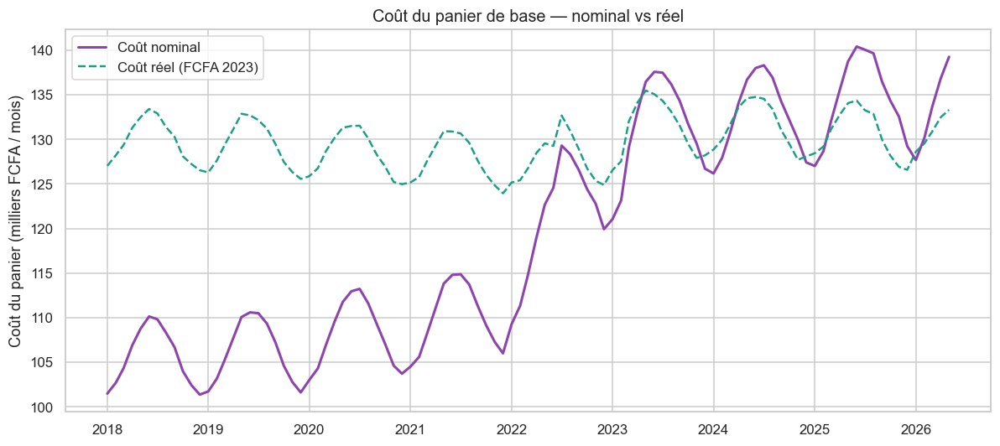
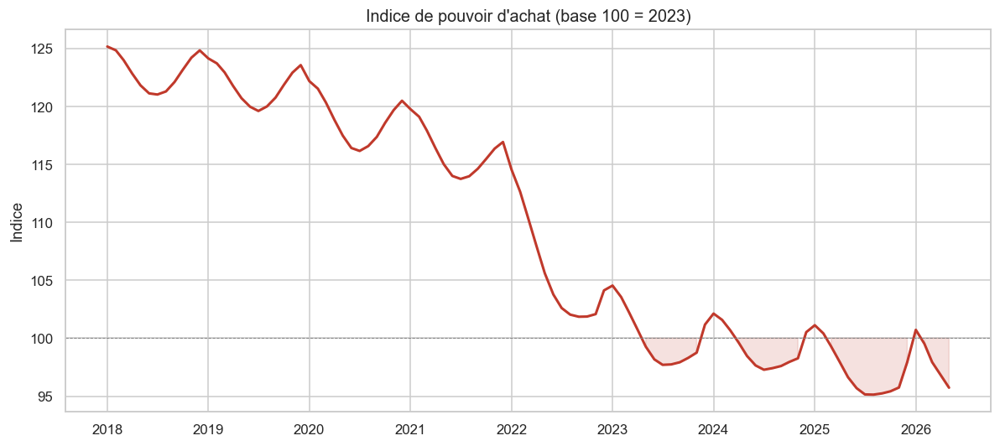
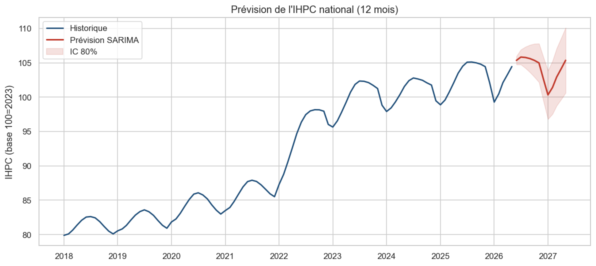
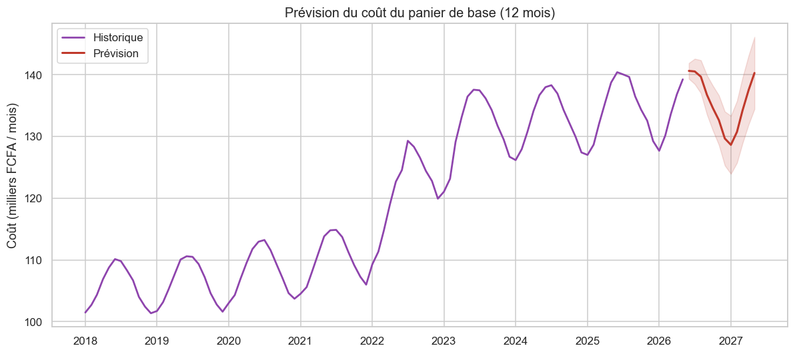

# Coût de la vie et inflation au Sénégal (2018–2026)
### Rapport analytique — Business Intelligence

> **Auteur** : projet portfolio Data Analyst / BI Developer
> **Période couverte** : janvier 2018 → mai 2026 (101 mois)
> **Base IHPC** : 100 = année 2023

---

## ⚠️ Note méthodologique sur les données

Ce projet combine **données officielles** et **reconstruction documentée** :

- **Calibré sur le réel (ANSD / Banque mondiale)** : la trajectoire de
  l'inflation nationale, le pic de 2022, la base 100 = 2023, la structure en
  12 divisions COICOP/NCOA et les 6 zones de collecte de l'IHPC.
- **Reconstruit / simulé** : le détail mensuel par **produit** et par **région**,
  l'ANSD ne publiant pas cette granularité dans un format structuré
  téléchargeable. Ces séries sont générées de façon **cohérente** avec les
  agrégats officiels (cf. `scripts/generate_data.py`).

La validation montre un écart moyen **< 0,2 point** entre l'inflation annuelle
reconstruite et les chiffres officiels de l'ANSD.

| Année | Inflation officielle ANSD/BM | Inflation reconstruite (projet) |
|------:|:---------------------------:|:-------------------------------:|
| 2019 | 1,0 % | 1,0 % |
| 2020 | 2,5 % | 2,6 % |
| 2021 | 2,2 % | 2,3 % |
| 2022 | **9,7 %** | **9,9 %** |
| 2023 | 5,9 % | 5,7 % |
| 2024 | 0,8 % | 0,9 % |
| 2025 | 2,0 % | 2,0 % |

---

## 1. Synthèse exécutive

Entre 2018 et 2026, le coût de la vie au Sénégal a connu **trois régimes** :

1. **2018–2021 — stabilité** : inflation contenue sous 3 %, conforme à
   l'ancrage de la zone UEMOA (parité fixe FCFA/euro).
2. **2022 — choc inflationniste** : flambée à **+9,9 % en moyenne**, avec un
   **pic de +14,0 % en novembre 2022**, sous l'effet conjugué de la hausse des
   prix alimentaires et énergétiques mondiaux (guerre en Ukraine).
3. **2023–2026 — désinflation** : retour progressif vers 1–2 %, l'inflation
   alimentaire restant le principal moteur résiduel.

Le **coût du panier de base** a augmenté de **+37 %** sur la période, érodant
sensiblement le **pouvoir d'achat** des ménages.

---

## 2. Évolution de l'inflation (2018–2026)

L'IHPC global passe d'un indice ~81 (2018) à ~105 (2026, base 100 = 2023).
Le glissement annuel met en évidence la rupture de 2022 :

- Inflation quasi nulle à modérée jusqu'en 2021 ;
- Accélération brutale en 2022 (pic **14,0 %**) ;
- Reflux marqué dès 2023, sous l'effet de la modération des cours mondiaux et
  des mesures de soutien (subventions énergie, homologation des prix).

---

## 3. Quels produits tirent l'inflation ?

Les produits **alimentaires de base** et **maraîchers** affichent les plus
fortes hausses cumulées 2018 → 2026 :

| Produit | Hausse cumulée |
|---|---:|
| Oignon local | +96 % |
| Pomme de terre | +77 % |
| Poisson frais (sardinelle) | +62 % |
| Mil (souna) | +56 % |
| Maïs | +54 % |
| Huile végétale raffinée | +49 % |
| Viande de bœuf | +47 % |
| Riz brisé ordinaire | +46 % |

Les produits **administrés** (carburants, gaz, électricité, pain) ont connu des
hausses par **paliers** (révisions tarifaires de 2022–2023) plutôt que continues.

### Alimentaire vs énergie

L'**inflation alimentaire** dépasse systématiquement l'inflation globale
(**12,1 %** en 2022). L'**énergie** culmine en 2023 (**10,1 %**), décalée d'un an
en raison des révisions tarifaires administrées (carburants à 990 FCFA/L,
électricité).

La heatmap par division confirme que les divisions
*« Produits alimentaires »*, *« Transport »* et *« Logement-énergie »* concentrent
l'essentiel de la pression inflationniste.

---

## 4. Analyse régionale

L'inflation et le niveau des prix diffèrent selon les **6 zones de collecte**.

- **Dakar** est la zone où le **panier coûte le plus cher** (niveau de prix
  élevé), mais où l'inflation est légèrement **plus modérée**.
- Les zones **du Sud et du Centre** (**Kolda**, Diourbel, Kaolack) subissent une
  inflation un peu **plus forte** (éloignement, coûts de transport).

| Région (zone) | Coût moyen du panier (12 derniers mois) |
|---|---:|
| Dakar | ~139 600 FCFA |
| Kolda | ~135 000 FCFA |
| Thiès | ~133 800 FCFA |
| Saint-Louis | ~132 200 FCFA |
| Kaolack | ~131 700 FCFA |
| Diourbel | ~130 700 FCFA |

Projetées sur les **14 régions administratives** (chacune rattachée à sa zone de
collecte IHPC), ces disparités donnent une lecture géographique immédiate :

---

## 5. Coût du panier de base & pouvoir d'achat

Le **coût mensuel du panier de base** (national) passe d'environ
**101 500 FCFA** (2018) à **139 300 FCFA** (2026), soit **+37 %**.

En **FCFA constants 2023** (déflaté), la hausse réelle reste visible sur la
période de choc 2022-2023, illustrant une **perte de pouvoir d'achat** que les
revenus n'ont pas toujours compensée.

---

## 6. Prévisions (forecasting)

Quatre approches ont été comparées sur un jeu de test de 12 mois :

| Modèle | RMSE | MAE | MAPE |
|---|---:|---:|---:|
| **SARIMA** ✅ | **0,77** | **0,61** | **0,60 %** |
| Marche aléatoire saisonnière | 2,02 | 1,86 | 1,79 % |
| Régression linéaire | 3,07 | 2,55 | 2,49 % |

Le modèle **SARIMA(1,1,1)(1,1,0)₁₂** est retenu (erreur la plus faible). Il
prévoit une **inflation maîtrisée (~0,7 % en moyenne)** sur les 12 prochains mois,
prolongeant la dynamique de désinflation.

> **Prophet** (Meta) est également intégré dans le notebook 03 et comparé
> automatiquement lorsqu'il est exécutable. Sur cette machine (Windows /
> Python 3.14), son backend de calcul *Stan* n'a pas pu s'exécuter (incompatibilité
> du binaire précompilé) ; le code reste valide et s'active dès qu'une toolchain
> compatible est présente (`conda-forge prophet` ou RTools).

> ⚠️ Prévisions à interpréter avec prudence : elles reposent sur la dynamique
> historique et n'intègrent pas les chocs exogènes (cours mondiaux, climat,
> décisions de politique économique).

---

## 7. Recommandations économiques

1. **Surveiller en priorité les produits volatils** : oignon, pomme de terre,
   poisson et huile — fortes hausses et forte saisonnalité (cf. boxplots).
2. **Cibler les régions du Sud/Centre** (Kolda, Diourbel, Kaolack) pour les
   politiques de soutien, où l'inflation est structurellement plus élevée.
3. **Sécuriser les filières stratégiques** (riz, huile, sucre) par le stockage
   et la diversification des importations pour amortir les chocs mondiaux.
4. **Maintenir un suivi mensuel du panier de base** comme indicateur social de
   référence, plus parlant que l'IHPC global pour les ménages.
5. **Anticiper les pics saisonniers** (Ramadan, Tabaski, soudure d'août-septembre)
   par des mesures préventives d'approvisionnement.

---

## 8. Limites

- Le détail **produit/région** est **reconstruit** (non officiel) : à utiliser à
  des fins analytiques et de démonstration, non comme statistique officielle.
- Les prévisions sont **univariées** (pas de variables exogènes : pétrole, taux
  de change, pluviométrie).
- L'IHPC ne couvre que **6 zones** représentatives, non les 14 régions
  administratives.

---

*Données : ANSD (calibration nationale) + reconstruction documentée. Outils :
Python (pandas, statsmodels, scikit-learn), SQL (PostgreSQL), Power BI.*
